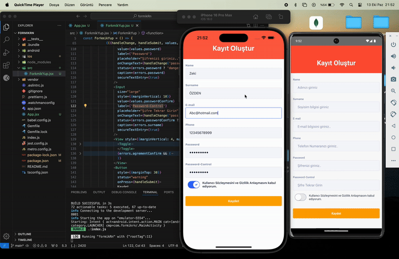

<h1>React Native Formik-Yup UI Kitten Form</h1>

  Bu proje, React Native CLI ile oluşturulmuş bir Formik/Yup destekli form sayfasıdır. Form, <code>@ui-kitten</code> bileşenleri ile tasarlanmıştır ve hem Android hem de iOS platformlarında çalışmaktadır. Aşağıda hem Android hem de iOS çıktılarının yer aldığı bir GIF bulunmaktadır.

<h2>Kullanılan Kütüphaneler</h2>
<ul>
  <li>@eva-design/eva: 2.2.0</li>
  <li>@ui-kitten/components: 5.3.1</li>
  <li>formik: 2.4.6</li>
  <li>react: 18.3.1</li>
  <li>react-native: 0.75.4</li>
  <li>react-native-svg: 15.7.1</li>
  <li>yup: 1.4.0</li>
</ul>

<h2>Proje Özeti</h2>

  Bu proje, kullanıcı girişlerini doğrulayan bir form oluşturur. Formik ve Yup kütüphaneleri ile doğrulama yapılır ve kullanıcı girişleri şifre alanı dahil olmak üzere UI Kitten bileşenleri ile stilize edilmiştir.

<h3>Form Özellikleri:</h3>
<ul>
  <li>E-posta alanı</li>
  <li>Şifre ve Şifre Doğrulama alanları</li>
  <li>Yup kullanarak e-posta ve şifre doğrulaması</li>
  <li>Şifre alanları <code>secureTextEntry</code> ile gizlenir</li>
</ul>

